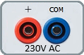
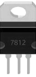

1. Click on the **Component** button to place components on the breadboard.

&emsp; &emsp; &emsp; &emsp; &emsp; &emsp; &emsp;  &emsp;  

**Fig. 1 Components** 

  
  

**Fig. 2 Circuit diagram of power supply**

2. Make connections as per the table given below.

**Table 1: Connection table**

 

  
3. Click on **Check Connection** button. If connections are right, click on **‘OK’**, then **Simulation** will become active.
4. Observe capacitor filter and DC waveform on C.R.O by adjusting C.R.O channel **CH1/CH2** and **TIME** knobs.
5. Use **X** Shift and **Y** Shift knobs for wave shifting.
6. Click on the **Reset** button to reset the webpage.

