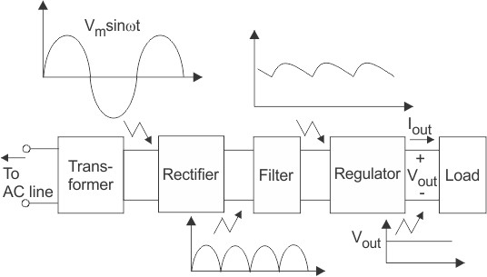
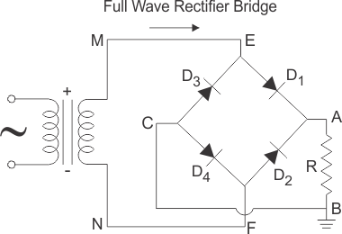
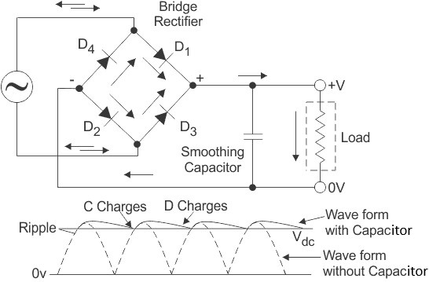

### Introduction

A regulated power supply converts unregulated AC (Alternating Current) to a constant DC (Direct Current). A regulated power supply is used to ensure that the output remains constant even if the input changes. A regulated DC power supply is also known as a linear power supply, it is an embedded circuit and consists of various blocks. 

The regulated power supply will accept an AC input and give a constant DC output. The figure below shows the block diagram of a typical regulated DC power supply.

**Fig. 1 Block diagram of regulated DC power supply** 

The basic building blocks of a regulated DC power supply are as follows:

1. A step-down transformer
2. A rectifier
3. A DC filter
4. A regulator

### **Operation of Regulated Power Supply**

#### **Step Down Transformer**

A step down transformer will step down the voltage from the ac mains to the required voltage level. The turn’s ratio of the transformer is so adjusted such as to obtain the required voltage value. The output of the transformer is given as an input to the rectifier circuit.

#### **Rectification**

Rectifier is an electronic circuit consisting of diodes which carries out the rectification process. Rectification is the process of converting an alternating voltage or current into corresponding direct (DC) quantity. The input to a rectifier is AC whereas its output is unidirectional pulsating DC.

Although a half wave rectifier could technically be used, its power losses are significant compared to a full wave rectifier. As such, a full wave rectifier or a bridge rectifier is used to rectify both the half cycles of the ac supply (full wave rectification). The figure below shows a full wave bridge rectifier.

**Fig. 2 Full Wave Bridge Rectifier** 

A bridge rectifier consists of four p-n junction diodes connected in the manner shown above. In the positive half cycle of the supply, the voltage induced across the secondary of the electrical transformer i.e., VMN is positive. Therefore point E is positive with respect to F. Hence, diodes D3 and D2 are reversed biased and diodes D1 and D4 are forward biased. The diode D3 and D2 will act as open switches (practically there is some voltage drop) and diodes D1 andD4 will act as closed switches and will start conducting. Hence a rectified waveform appears at the output of the rectifier as shown in the first figure. When voltage induced in secondary i.e. VMN is negative than D3 and D2 are forward biased with the other two reversed biased and a positive voltage appears at the input of the filter.

### **DC Filtration**

The rectified voltage from the rectifier is a pulsating DC voltage having very high ripple content. But this is not we want, we want a pure ripple free DC waveform. Hence a filter is used. Different types of filters are used such as capacitor filter, LC filter, Choke input filter, π type filter. The figure below shows a capacitor filter connected along the output of the rectifier and the resultant output waveform.

**Fig. 3 Resultant Output Waveform** 

As the instantaneous voltage starts increasing the capacitor charges, it charges until the waveform reaches its peak value. When the instantaneous value starts reducing the capacitor starts discharging exponentially and slowly through the load (input of the regulator in this case). Hence, an almost constant DC value having very less ripple content is obtained.

### **Regulation**

This is the last block in a regulated DC power supply. The output voltage or current will change or fluctuate when there is a change in the input from ac mains or due to change in load current at the output of the regulated power supply or due to other factors like temperature changes. This problem can be eliminated by using a regulator. A regulator will maintain the output constant even when changes at the input or any other changes occur. Transistor series regulator, Fixed and variable IC regulators or a zener diode operated in the zener region can be used depending on their applications. IC’s like 78XX and 79XX (such as the IC 7812) are used to obtained fixed values of voltages at the output.

### **Features of Regulated Power Supply**

1. Regulated power supplies are relatively more reliable.
2. Regulated power supplies have less complex circuit and less weight.
3. The cost and noise level of the regulated power supplies is low.
4. Regulated power supplies give faster response.

### **Applications of Regulated Power Supplies**

1. Mobile charging circuits
2. Testing circuits
3. Oscillators and amplifiers
4. Electronic computers
5. Automatic control systems

